# Práctica 3: Aplicaciones Nativas

<p align="center">
  <b>Instituto Politécnico Nacional</b><br>
  <b>Escuela Superior de Cómputo (ESCOM)</b><br>
  Ingeniería en Sistemas Computacionales · Plan 2020
</p>

| Dato | Valor |
| :--- | :--- |
| **Unidad de aprendizaje** | Desarrollo de Aplicaciones Móviles Nativas |
| **Profesor** | Hurtado Avilés Gabriel |
| **Grupo** | 7CV4 |
| **Integrantes** | Caballero Pérez Julio César — 2023630158<br>Velázquez Beltrán Brandon — 2023630925 |
| **Fecha de entrega** | Lunes 28 de septiembre de 2026 |
| **Repositorio** | https://github.com/BrandonVel47/Practica-3 |

---

## Índice

1. [Introducción](#introducción)
2. [Estructura del repositorio](#estructura-del-repositorio)
3. [Estado de avance](#estado-de-avance)
4. [Ejercicio 1: Instalación de iOS/macOS en la mejor PC del equipo](#ejercicio-1-instalación-de-iosmacos-en-la-mejor-pc-del-equipo)
5. [Ejercicio 2: Gestor de Archivos para iPhone](#ejercicio-2-gestor-de-archivos-para-iphone-desarrollado-desde-macos)
6. [Ejercicio 3: Cámara y Micrófono para iPhone](#ejercicio-3-aplicación-de-cámara-y-micrófono-para-iphone-desarrollada-desde-macos)
7. [Ejercicio 4: Desarrollo multiplataforma con Flutter](#ejercicio-4-desarrollo-multiplataforma-con-flutter)
8. [Ejercicio 5: Desarrollo multiplataforma con Kotlin Multiplatform](#ejercicio-5-desarrollo-multiplataforma-con-kotlin-multiplatform-kmp)
9. [Pruebas realizadas](#pruebas-realizadas)
10. [Bitácora de trabajo](#bitácora-de-trabajo)
11. [Conclusiones](#conclusiones)
12. [Bibliografía](#bibliografía)

---

## Introducción

El objetivo de esta práctica es desarrollar aplicaciones nativas para los ecosistemas Android y Apple que interactúen con recursos del dispositivo (sistema de archivos, cámara y micrófono) y que almacenen su información de forma local, sin depender de una conexión a Internet.

Como ningún integrante cuenta con una Mac física, el entorno de desarrollo de Apple se virtualizó con **macOS Ventura (13)** dentro de un contenedor Docker, siguiendo el repositorio de la práctica [gabrielhuav/MacOS-Docker](https://github.com/gabrielhuav/MacOS-Docker) (basado en `sickcodes/docker-osx`). La instalación se hizo **únicamente en la PC con mejores especificaciones** (la de Brandon Velázquez) y ambos integrantes trabajaron sobre ella.

Sobre ese entorno se instaló **Xcode** con el simulador de **iPhone 15 Pro (iOS 17.2)**, en el que se desarrollaron y ejecutaron las aplicaciones nativas en Swift/SwiftUI de los ejercicios 2 y 3. Para los ejercicios multiplataforma se usaron **Flutter** (ejercicio 4) y **Kotlin Multiplatform con Compose Multiplatform** (ejercicio 5), compilando el binario de Android desde Android Studio y el de iOS desde Xcode en el entorno macOS.

Todas las aplicaciones implementan los dos temas institucionales, **Guinda (IPN)** y **Azul (ESCOM)**, con adaptación automática al modo claro u oscuro del sistema.

---

## Estructura del repositorio

```
Practica-3/
├── README.md                      ← Este documento (informe técnico)
├── AcercaDe_PC1.png               ← Especificaciones de la PC 1 (seleccionada)
├── AcercaDe_PC2.png               ← Especificaciones de la PC 2
├── MacOS-Docker/
│   ├── Reporte.md                 ← Guía paso a paso de instalación de macOS con Docker
│   ├── assets/                    ← Capturas de apoyo de la guía
│   └── Imagenes/                  ← Evidencias de los ejercicios 1, 2 y 3
├── Ejercicio2-GestorArchivos/     ← Gestor de Archivos nativo en Swift/SwiftUI (Ejercicio 2)
│   └── GestorArchivos/
│       ├── ContentView.swift      ← Lista, importación, compartir, eliminar y temas
│       └── PreviewController.swift← Vista previa con QLPreviewController
├── Ejercicio3-CamaraMicrofono/    ← App de Cámara y Micrófono en Swift/SwiftUI (Ejercicio 3)
│   └── CamaraMicrofonoApp/
│       └── ContentView.swift      ← Captura de imagen, audio e historial local
└── Ejercicio5-KMP/
    └── GestorKMP/                 ← Proyecto Kotlin Multiplatform (Ejercicio 5)
        ├── androidApp/            ← App Android (punto de entrada + APK release)
        ├── iosApp/                ← App iOS (proyecto Xcode, punto de entrada SwiftUI)
        └── shared/                ← Módulo compartido (commonMain / androidMain / iosMain)
```

> Los proyectos de los ejercicios 2 y 3 se crearon y compilaron con Xcode dentro de la máquina virtual macOS. El proyecto Flutter del ejercicio 4 se integrará en `Ejercicio4-Flutter/`.

---

## Estado de avance

| Ejercicio | Descripción | Responsable principal | Estado |
| :---: | :--- | :--- | :--- |
| 1 | Instalación de macOS con Docker + Xcode | Velázquez Beltrán Brandon | ✅ Completado |
| 2 | Gestor de Archivos nativo para iPhone (Swift/SwiftUI) | Velázquez Beltrán Brandon | 🔄 Funcionalidad base completada |
| 3 | Cámara y Micrófono nativa para iPhone (Swift/SwiftUI) | Caballero Pérez Julio César | 🔄 Fotos e historial local funcionales · grabación de audio en desarrollo |
| 4 | Aplicación multiplataforma con Flutter | Velázquez Beltrán Brandon | 🔄 En desarrollo |
| 5 | Gestor de Archivos multiplataforma con KMP | Caballero Pérez Julio César | ✅ Android completado · 🔄 compilación iOS |

---

## Ejercicio 1: Instalación de iOS/macOS en la Mejor PC del Equipo

### 1.1 Identificación del equipo

Se compararon las computadoras de ambos integrantes para decidir cuál tenía la capacidad suficiente para virtualizar macOS con aceleración KVM.

| Característica | PC 1 — Brandon Velázquez (**seleccionada**) | PC 2 — Julio César Caballero |
| :--- | :--- | :--- |
| **Modelo** | Escritorio (tarjeta madre ASRock A520M) | Laptop ASUS ZenBook UX533FN |
| **CPU** | AMD Ryzen 7 5700G (8 núcleos / 16 hilos, 3.80 GHz) | Intel Core i5-8265U (4 núcleos / 8 hilos, 1.60 GHz base) |
| **RAM** | 32 GB DDR4 (2133 MT/s) | 8 GB DDR4 (2400 MT/s, 7.82 GB utilizables) |
| **Almacenamiento** | 1 TB SSD (932 GB útiles, 847 GB libres) | 512 GB SSD (477 GB útiles, ≈319 GB libres) |
| **GPU** | AMD Radeon RX 6600 (8 GB) | Gráficos integrados Intel + GPU dedicada de 2 GB |
| **Sistema operativo** | Windows 11 Pro 25H2 (64 bits) | Windows 11 (64 bits) |

**Justificación de la elección:** la RAM fue el factor decisivo. El repositorio recomienda 16 GB para virtualizar macOS; la PC 2 tiene solo 8 GB en total, por lo que no cumple el requisito mínimo, mientras que la PC 1 tiene 32 GB y permitió asignar **16 GB exclusivamente a la máquina virtual** sin dejar sin recursos al sistema anfitrión. Además, el Ryzen 7 tiene el doble de núcleos físicos y mayor frecuencia que el i5-8265U (un procesador de bajo consumo para laptop), lo que permitió dedicar 6 núcleos a macOS, y el SSD de 1 TB tiene espacio suficiente para el disco virtual de 270 GB, macOS y Xcode (que por sí solo requiere más de 40 GB).

**Integrante responsable del entorno:** Velázquez Beltrán Brandon — Boleta 2023630925. La instalación se realizó únicamente en su computadora.

**Mac física:** ningún integrante cuenta con una Mac física, por lo que se virtualizó macOS con Docker. No fue necesario unirse con otro equipo.

| PC 1 — Brandon (seleccionada) | PC 2 — Julio |
| :---: | :---: |
| 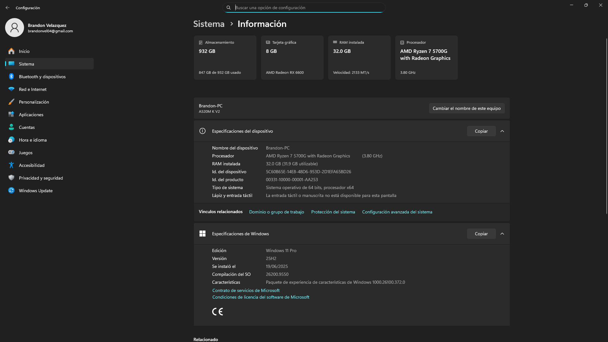 | 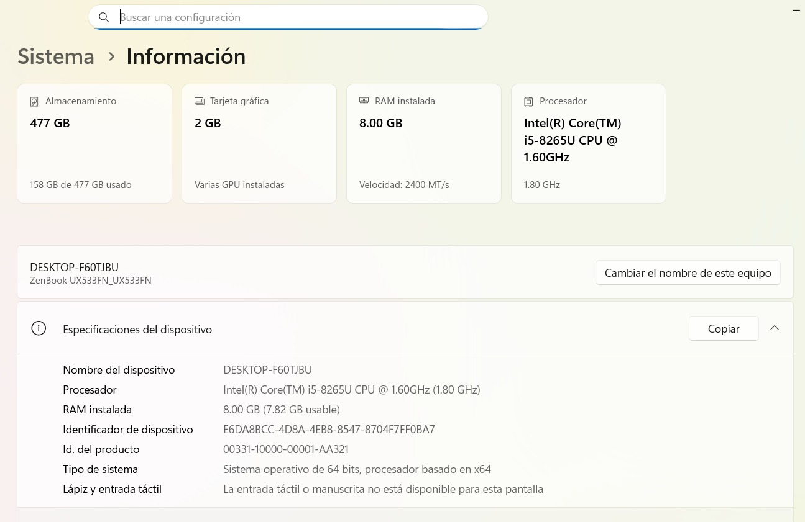 |

*Figura 1.1. Especificaciones de ambas PCs (Configuración → Sistema → Información de Windows).*

### 1.2 Trabajo en equipo

Aunque el entorno se instaló en una sola computadora, ambos integrantes participaron en la actividad. El historial de commits del repositorio refleja la participación de los dos (usuarios `BrandonVel47` y `JulioCesarCaballero`) y se trabajó en ramas separadas para los ejercicios multiplataforma (`b-ejercicio4-flutter` y `b-ejercicio5-kmp`), integradas a `main` mediante *pull request*. El registro detallado de las sesiones está en la sección [Bitácora de trabajo](#bitácora-de-trabajo).

### 1.3 Instalación del entorno macOS con Docker

La guía completa paso a paso, con comandos para Windows y Linux, está en [`MacOS-Docker/Reporte.md`](./MacOS-Docker/Reporte.md). A continuación se resume el proceso que se siguió en la PC 1.

**Paso 1. Integración de Docker Desktop con WSL.** En *Settings → Resources → WSL Integration* se habilitó la integración con la distribución por defecto (Ubuntu).

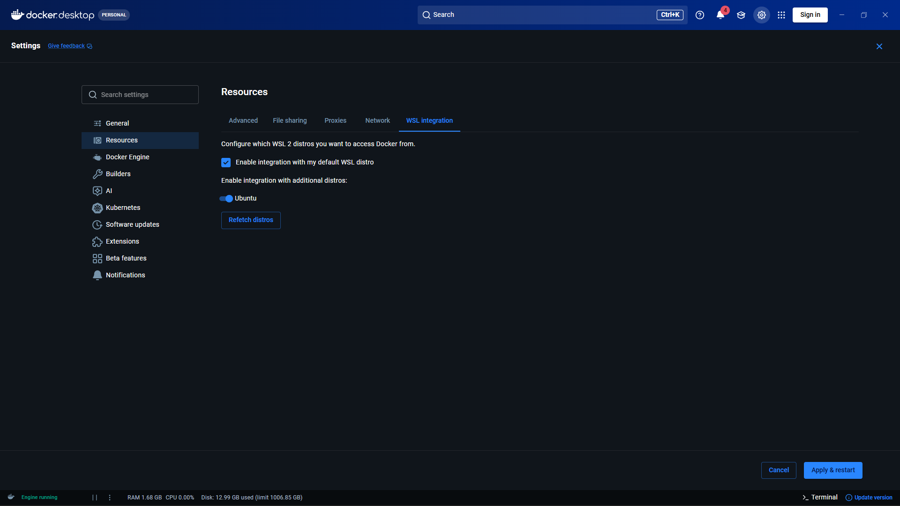
*Figura 1.2. Integración de Docker Desktop con la distribución Ubuntu de WSL.*

**Paso 2. Virtualización anidada.** Se editó el archivo `.wslconfig` del usuario de Windows para habilitar la virtualización anidada, necesaria para que KVM funcione dentro de WSL2:

```ini
[wsl2]
nestedVirtualization=true
```

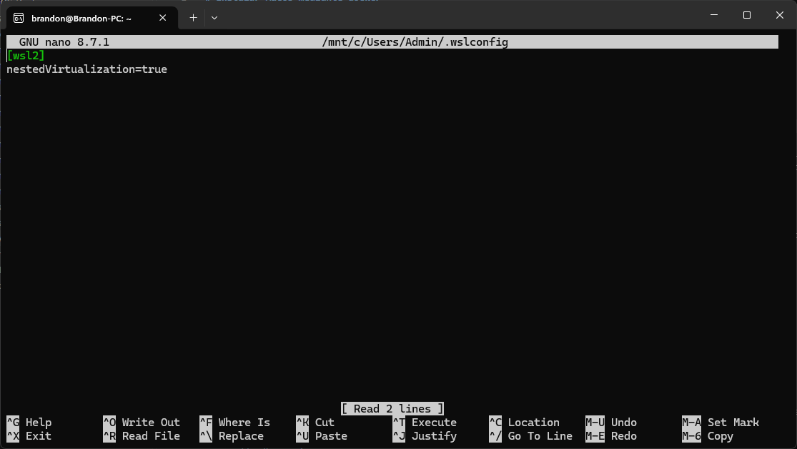
*Figura 1.3. Configuración de `.wslconfig` con `nano`.*

**Paso 3. Dependencias de KVM y X11.** Se verificó KVM con `kvm-ok` y se instalaron las dependencias de virtualización y de ventanas gráficas:

```bash
sudo apt -y install bridge-utils cpu-checker libvirt-clients libvirt-daemon qemu qemu-kvm
sudo apt install x11-apps -y
```

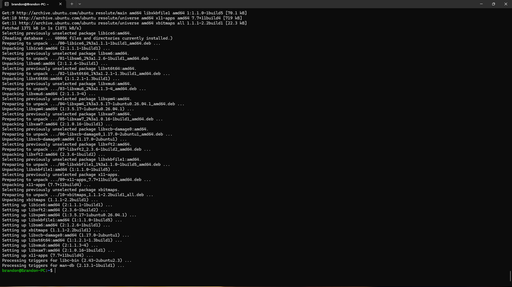
*Figura 1.4. Instalación de las dependencias de KVM y `x11-apps` en Ubuntu (WSL).*

**Paso 4. Ejecución del contenedor.** Se ejecutó la imagen `sickcodes/docker-osx` con los recursos ajustados a la PC 1:

```bash
docker run -it \
    --device /dev/kvm \
    -p 50922:10022 \
    -e "DISPLAY=${DISPLAY:-:0.0}" \
    -v /mnt/wslg/.X11-unix:/tmp/.X11-unix \
    -e GENERATE_UNIQUE=true \
    -e MASTER_PLIST_URL='https://raw.githubusercontent.com/sickcodes/osx-serial-generator/master/config-custom.plist' \
    -e SHORTNAME=ventura \
    -e RAM=16 \
    -e SMP=8 \
    -e CORES=6 \
    sickcodes/docker-osx:latest
```

| Recurso | Valor asignado | Motivo |
| :--- | :--- | :--- |
| `RAM` | 16 GB | La mitad de la RAM física; Xcode y el simulador consumen mucha memoria |
| `CORES` | 6 núcleos | Deja 2 núcleos físicos libres para Windows y WSL |
| `SMP` | 8 hilos | Mejora la compilación en paralelo dentro de macOS |
| Disco virtual | 270 GB (qcow2) | Tamaño creado por el script; suficiente para macOS + Xcode + simuladores |

Al iniciar, el script descargó la imagen de recuperación de **macOS Ventura (13)** y creó el disco virtual `mac_hdd_ng.img`.


*Figura 1.5. Descarga de `BaseSystem.dmg` (Ventura) y creación del disco virtual de 256 GiB.*

**Paso 5. Formateo del disco virtual.** Desde el menú de recuperación se abrió *Disk Utility* y se borró el disco `QEMU HARDDISK Media` (≈270 GB), nombrándolo `MacOS` con formato **APFS** y esquema **GUID Partition Map**.

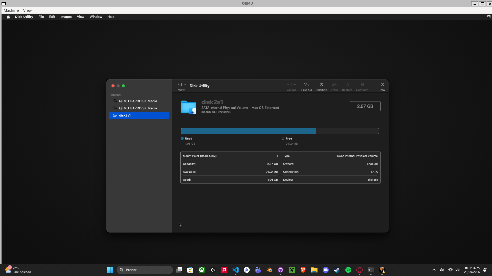
*Figura 1.6. Discos detectados en Disk Utility.*

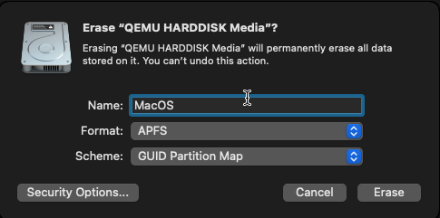
*Figura 1.7. Formateo del disco QEMU como APFS / GUID Partition Map.*

**Paso 6. Instalación de macOS Ventura.** Se instaló macOS sobre el disco `MacOS`. La instalación tardó más de dos horas y requirió varios reinicios del contenedor.

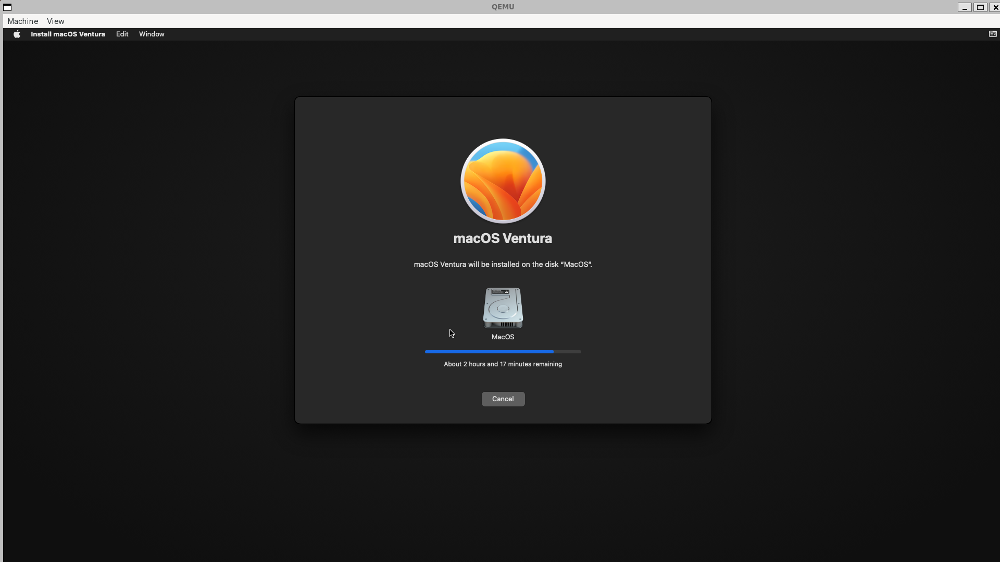
*Figura 1.8. Instalación de macOS Ventura sobre el disco virtual.*

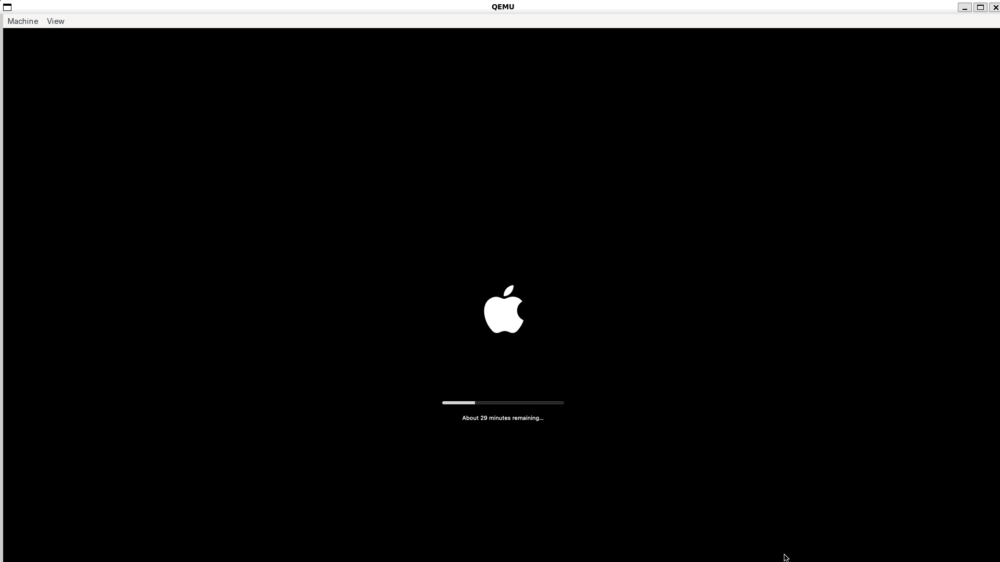
*Figura 1.9. Arranque del sistema tras el reinicio.*

**Paso 7. Configuración inicial.** Se completó el asistente de configuración de macOS, omitiendo el inicio de sesión con Apple ID en ese paso.

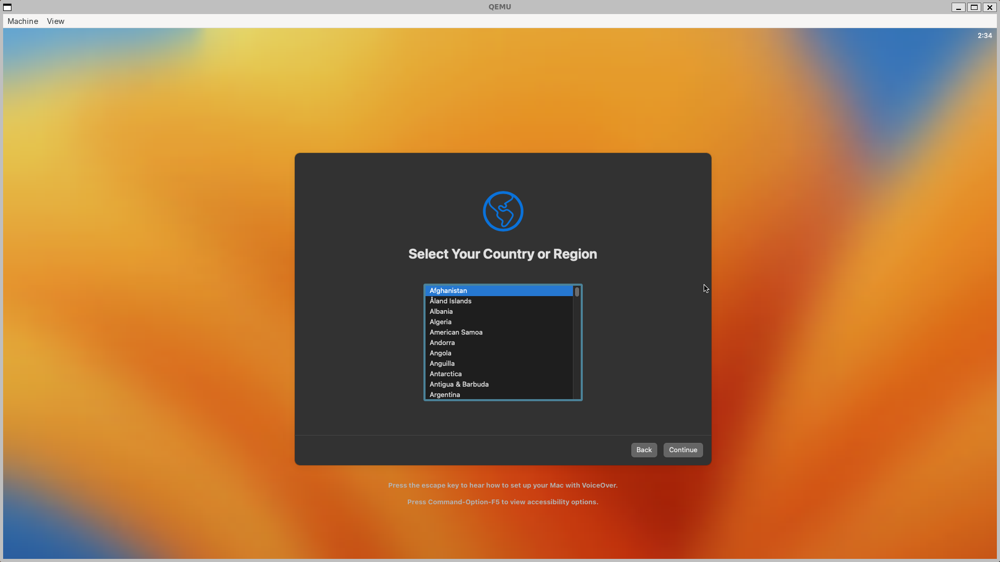
*Figura 1.10. Asistente de configuración inicial de macOS.*

**Paso 8. Verificación de red.** Se comprobó el acceso a Internet dentro del contenedor abriendo Google en Safari.

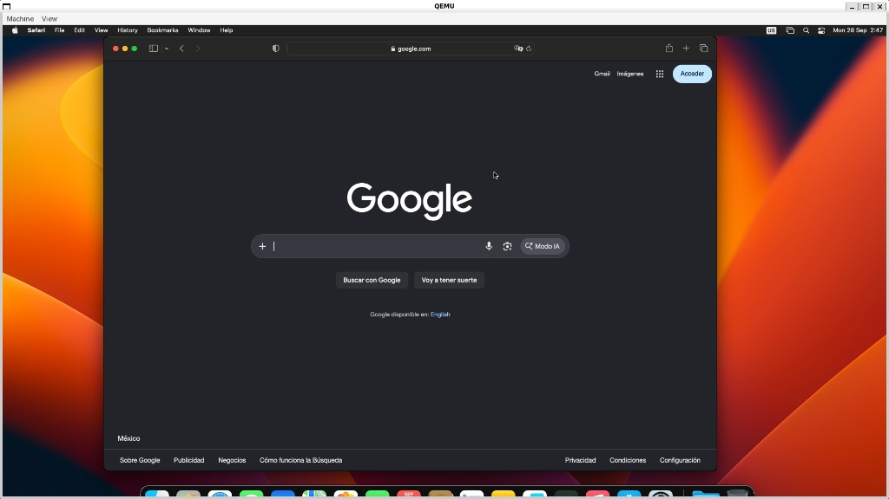
*Figura 1.11. Verificación de conexión a Internet desde Safari en la máquina virtual.*

### 1.4 Configuración del entorno de desarrollo iOS

Se inició sesión con un Apple ID gratuito y se instaló **Xcode** en una versión compatible con macOS Ventura (consultada en [xcodereleases.com](https://xcodereleases.com/)). Se configuró el simulador **iPhone 15 Pro con iOS 17.2**.

Para verificar el entorno se creó un proyecto de prueba en Swift/SwiftUI (plantilla *Hello, world!*), que se compiló y ejecutó correctamente en el simulador. Este mismo proyecto se convirtió después en la base del Gestor de Archivos del ejercicio 2.

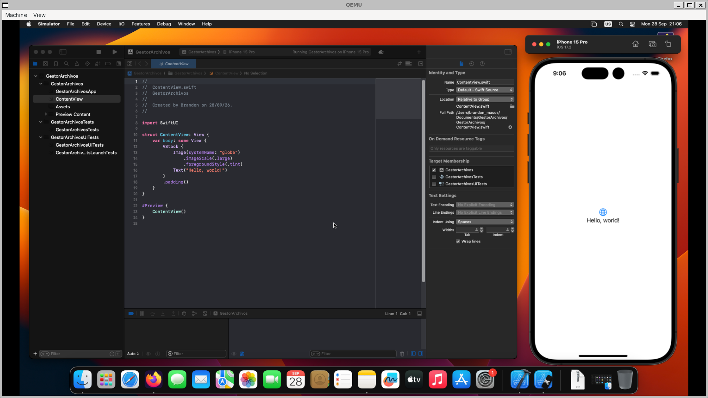
*Figura 1.12. Xcode ejecutando el proyecto de prueba en el simulador de iPhone 15 Pro (iOS 17.2).*

### 1.5 Entregables del Ejercicio 1

- [x] Informe de especificaciones comparativas de las PCs del equipo, con capturas de ambas
- [x] Guía paso a paso de la instalación con capturas ([`MacOS-Docker/Reporte.md`](./MacOS-Docker/Reporte.md) y sección 1.3)
- [x] Capturas del entorno macOS funcionando y con acceso a Internet
- [x] Xcode instalado y proyecto Swift de prueba ejecutándose en el simulador de iOS
- [x] Registro del integrante responsable y justificación de la elección
- [x] Bitácora de las sesiones de trabajo
- [ ] Captura de Homebrew, CocoaPods y Swift Package Manager instalados

---

## Ejercicio 2: Gestor de Archivos para iPhone (desarrollado desde macOS)

**Responsable principal:** Velázquez Beltrán Brandon
**Proyecto Xcode:** `GestorArchivos` · **Código:** [`Ejercicio2-GestorArchivos/`](./Ejercicio2-GestorArchivos) · **Lenguaje:** Swift 5 · **UI:** SwiftUI · **Destino:** simulador iPhone 15 Pro (iOS 17.2)

### 2.1 Descripción técnica

Aplicación nativa que administra los archivos del *sandbox* de la app (carpeta `Documents`) mediante `FileManager`. El código se divide en dos archivos:

| Archivo | Contenido |
| :--- | :--- |
| `ContentView.swift` | Pantalla principal, `IdentifiableURL` y `ShareSheet` |
| `PreviewController.swift` | Integración de Quick Look (`QLPreviewController`) |

- **Listado del sandbox:** al abrir la pantalla, `loadExistingFiles()` lee el contenido de `Documents` con `FileManager.contentsOfDirectory(at:)`, por lo que los archivos importados persisten entre ejecuciones.
- **Importación de archivos:** el modificador `.fileImporter` presenta el selector de documentos del sistema (`UIDocumentPickerViewController`) para traer archivos desde la app Archivos o iCloud Drive. El archivo externo se abre con `startAccessingSecurityScopedResource()`, se copia a `Documents` (reemplazando uno con el mismo nombre) y el acceso se libera con `defer`.
- **Vista previa nativa:** `PreviewController` envuelve `QLPreviewController` en un `UIViewControllerRepresentable`; un `Coordinator` actúa como `QLPreviewControllerDataSource` y entrega la URL del archivo como `QLPreviewItem`. Se presenta con `.sheet(item:)` al tocar una fila.
- **Compartir / exportar:** `ShareSheet` envuelve `UIActivityViewController` y se abre desde el **menú contextual** (mantener presionado → *Compartir*).
- **Eliminar:** el gesto de deslizar (`.onDelete`) borra el archivo físicamente con `FileManager.removeItem(at:)` y lo quita de la lista.
- **Navegación:** `NavigationStack` con título grande y barra de herramientas (botón `+` para importar y botón de paleta para el tema).
- **Manejo de errores:** las operaciones de disco van dentro de `do/catch`, de modo que un archivo inaccesible no cierra la aplicación.

### 2.2 Temas personalizables

Los colores se definieron en el catálogo `Assets.xcassets` como *Color Sets* con variantes **Any Appearance / Dark**, de modo que iOS cambia automáticamente el tono al alternar entre modo claro y oscuro. El tema se elige desde un `Menu` en el botón de paleta de la barra de navegación, se guarda con `@AppStorage("temaSeleccionado")` (UserDefaults) y se aplica como color de acento con `.tint(Color("IPNGuinda"))` o `.tint(Color("ESCOMAzul"))`.

| Tema | Color Set | Modo claro | Modo oscuro |
| :--- | :--- | :---: | :---: |
| Guinda (IPN) | `IPNGuinda` | `#6C1D45` | `#8A2558` |
| Azul (ESCOM) | `ESCOMAzul` | `#005E90` | `#4A90E2` |

| Guinda · claro | Guinda · oscuro |
| :---: | :---: |
|  | 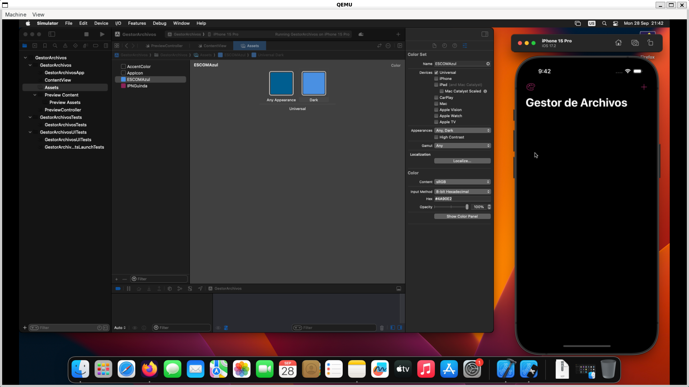 |
| **Azul · claro** | **Azul · oscuro** |
| 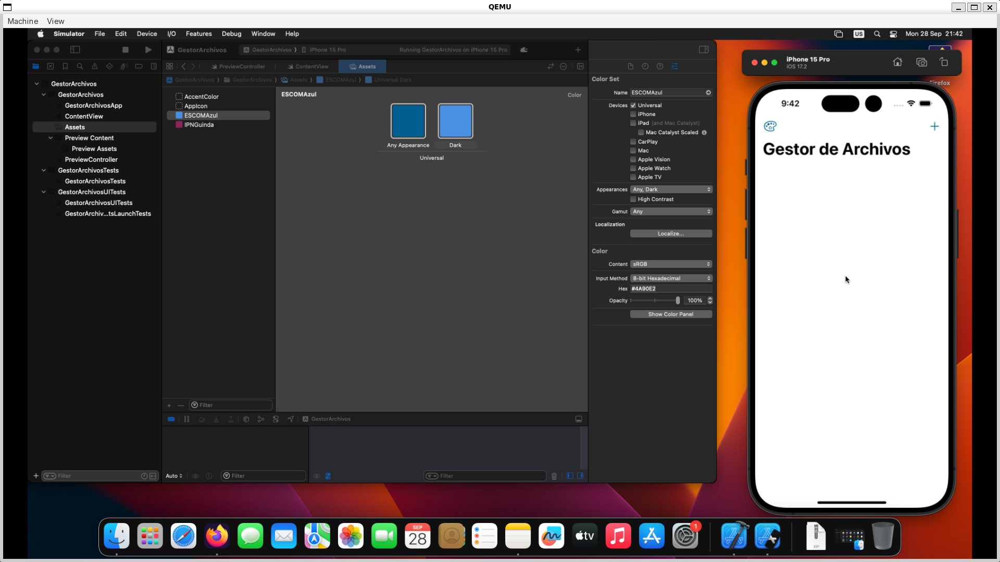 |  |

*Figura 2.1. Temas Guinda y Azul adaptándose al modo claro y oscuro del sistema.*

### 2.3 Evidencias de funcionamiento

**Importación al sandbox.** Se importó `documento de prueba.pdf` desde la app Archivos; el archivo aparece en la lista principal.

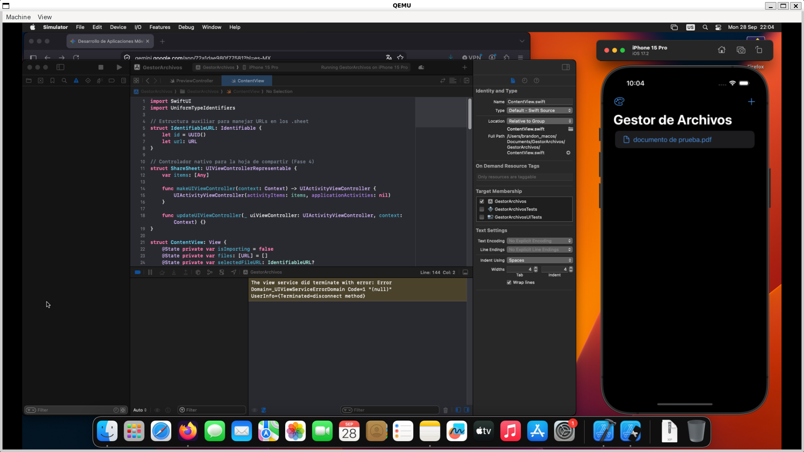
*Figura 2.2. Archivo importado con `UIDocumentPickerViewController` (`.fileImporter`).*

**Vista previa con Quick Look.** Al tocar el archivo se abre en `QLPreviewController` a pantalla completa.

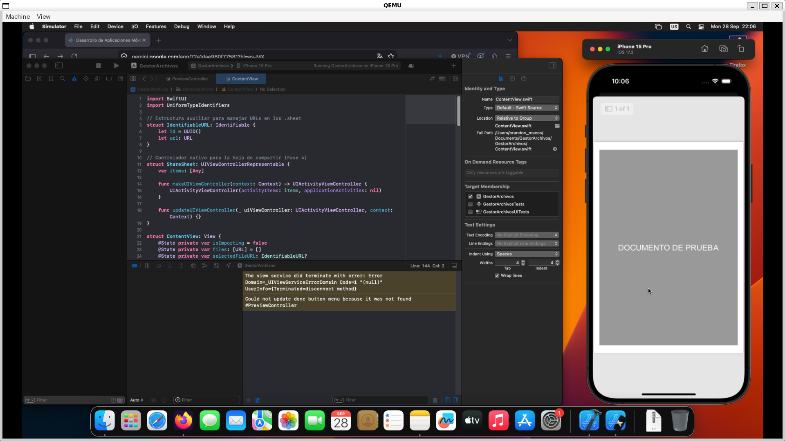
*Figura 2.3. Visualización del PDF con `QLPreviewController`.*

**Hoja de compartir.** Desde el menú contextual se invoca `UIActivityViewController` para exportar el archivo.

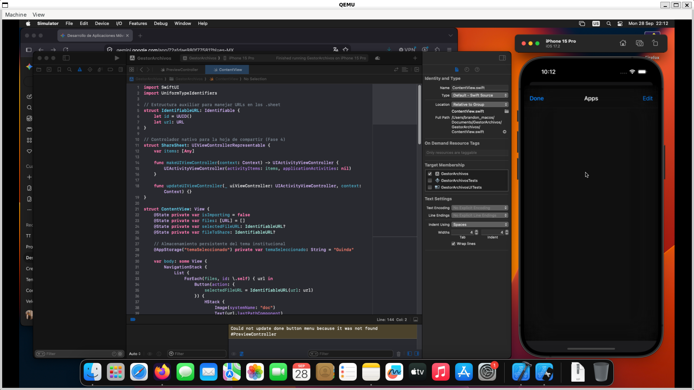
*Figura 2.4. Hoja de compartir nativa del sistema.*

**Eliminar con gesto.** Al deslizar la fila hacia la izquierda aparece el botón *Delete*.

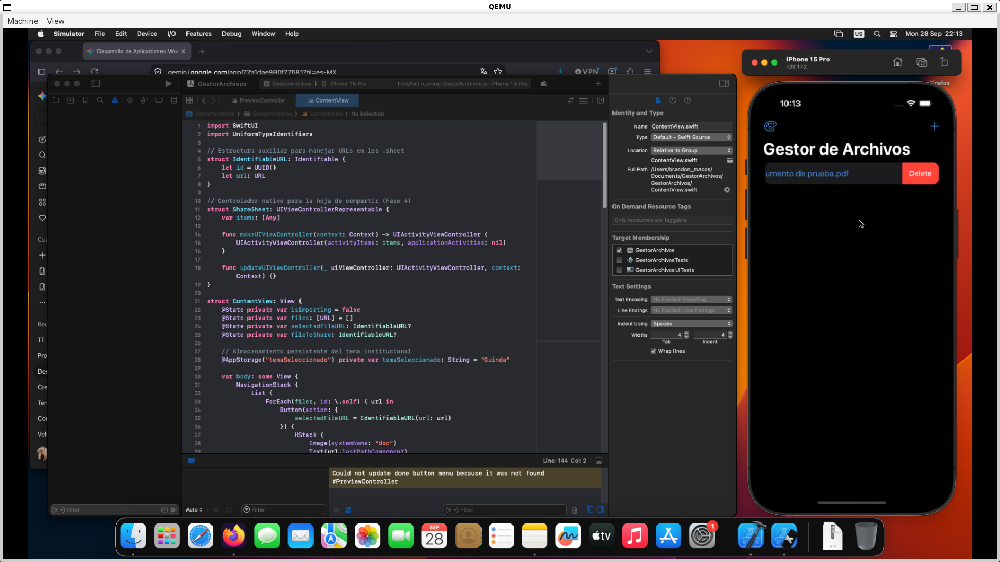
*Figura 2.5. Gesto de deslizar para eliminar.*

### 2.4 Cobertura de requisitos

| Requisito | Estado |
| :--- | :---: |
| Listado de `Documents` con `FileManager` | ✅ |
| Importar con `UIDocumentPickerViewController` y acceso *security-scoped* | ✅ |
| Vista previa con `QLPreviewController` | ✅ |
| Compartir con `UIActivityViewController` | ✅ |
| Temas Guinda / Azul con modo claro y oscuro | ✅ |
| Persistencia del tema seleccionado (`@AppStorage`) | ✅ |
| Navegación con `NavigationStack` | ✅ |
| Deslizar para eliminar | ✅ |
| Mantener presionado para menú contextual | ✅ |
| Navegación entre subcarpetas y carpetas `Inbox` / `tmp` | 🔄 |
| Íconos por tipo de archivo (`UTType`) | 🔄 |
| Visor de texto e imágenes con zoom / rotación | 🔄 |
| Crear carpetas, copiar, mover y renombrar | 🔄 |
| Confirmación antes de eliminar | 🔄 |
| Búsqueda y ordenamiento (nombre, fecha, tamaño) | 🔄 |
| Deslizar hacia abajo para actualizar | 🔄 |
| Recientes, favoritos y caché de miniaturas | 🔄 |
| Última carpeta y criterio de orden persistentes | 🔄 |
| *Security-scoped bookmarks* persistentes | 🔄 |
| `UIFileSharingEnabled` y `LSSupportsOpeningDocumentsInPlace` en Info.plist | 🔄 |
| Versión para macOS (Mac Catalyst) — opcional | ⬜ |

### 2.5 Instalación y uso

1. Abrir el entorno macOS (sección 1.3) e iniciar Xcode.
2. Abrir `GestorArchivos.xcodeproj`, seleccionar el esquema **GestorArchivos** y el destino **iPhone 15 Pro**.
3. Ejecutar con **⌘R**. Requisitos: Xcode 15 o superior, iOS 17 o superior.
4. En la app: tocar **+** para importar un archivo, tocar una fila para verla con Quick Look, mantener presionada una fila para **Compartir**, deslizar a la izquierda para **eliminar** y usar el botón de paleta para cambiar entre **Guinda** y **Azul**. El modo claro/oscuro se prueba en el simulador desde *Features → Toggle Appearance* (⇧⌘A).

---

## Ejercicio 3: Aplicación de Cámara y Micrófono para iPhone (desarrollada desde macOS)

**Responsable principal:** Caballero Pérez Julio César
**Proyecto Xcode:** `CamaraMicrofonoApp` · **Código:** [`Ejercicio3-CamaraMicrofono/`](./Ejercicio3-CamaraMicrofono) · **Lenguaje:** Swift 5 · **UI:** SwiftUI · **Destino:** simulador iPhone 15 Pro (iOS 17.2)

### 3.1 Configuración del entorno

Se reutilizó el entorno macOS y la instalación de Xcode del ejercicio 1, con el mismo simulador de iPhone 15 Pro (iOS 17.2). La compilación y el despliegue en el simulador funcionaron sin configuración adicional.

### 3.2 Descripción técnica

- **Permisos:** se declararon en el `Info.plist` las claves `NSCameraUsageDescription` y `NSMicrophoneUsageDescription` con los mensajes que se muestran al usuario al pedir acceso.
- **Fuente de imágenes:** el simulador de iOS no dispone de cámara física, por lo que, conforme a lo indicado en la práctica, se implementó como **fuente alternativa la selección desde la fototeca con `PhotosPicker`** (la versión SwiftUI de `PHPickerViewController`). Al elegir una foto, `loadTransferable(type: Data.self)` obtiene sus bytes de forma asíncrona, la imagen se muestra en la tarjeta *Captura de Imagen* y se guarda en el almacenamiento local.
- **Almacenamiento de archivos:** `saveImageLocally(data:)` escribe la imagen en la carpeta `Documents` del sandbox con un nombre único basado en la fecha (`foto_<timestamp>.jpg`).
- **Metadatos:** cada elemento guardado se representa con la estructura `MediaItem` (`id`, `title`, `date`, `type`, `fileName`), que es `Codable`. La lista completa se serializa como JSON con `JSONEncoder` y se guarda en `UserDefaults`; al abrir la app, `loadSavedItems()` la recupera, así que el historial persiste entre ejecuciones.
- **Historial local:** lista *Historial Local (Sandbox)* con ícono por tipo (foto / onda de audio), nombre y fecha de cada elemento; se puede quitar un elemento deslizando la fila.
- **Sección de audio:** un mismo botón alterna entre *Iniciar Grabación* y *Detener y Guardar* (en rojo mientras graba) y actualiza el mensaje de estado. Por ahora, al detener se registra la entrada `audio_<timestamp>.m4a` en el historial; la captura real con `AVAudioRecorder` está en desarrollo.
- **Interfaz:** `GroupBox` para cada sección, `ContentUnavailableView` (iOS 17) cuando no hay imagen y título grande con `NavigationStack`.
- **Tema:** mismo `Menu` de paleta y persistencia `@AppStorage("temaSeleccionado")` que el ejercicio 2, con los Color Sets Guinda (IPN) y Azul (ESCOM).

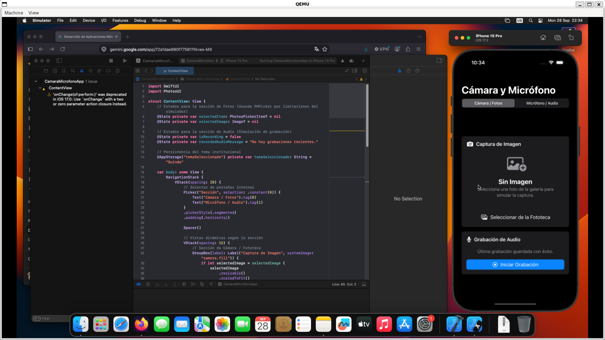
*Figura 3.1. Primera versión de la interfaz con las secciones de cámara/fotos y micrófono/audio.*

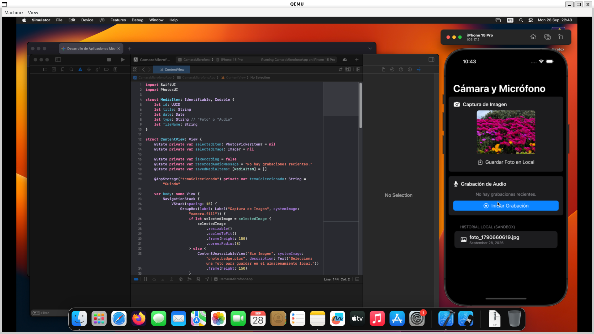
*Figura 3.2. Foto seleccionada desde la fototeca, guardada en el sandbox como `foto_1790660619.jpg` y registrada en el historial local.*

### 3.3 Cobertura de requisitos

| Requisito | Estado |
| :--- | :---: |
| Claves de privacidad en Info.plist | ✅ |
| Interfaz por secciones con tema institucional | ✅ |
| Fuente alternativa de fotos para el simulador (`PhotosPicker`) | ✅ |
| Guardar las fotos en el almacenamiento del dispositivo (`Documents`) | ✅ |
| Metadatos persistentes (fecha, tipo, nombre) en JSON + `UserDefaults` | ✅ |
| Historial de contenido guardado con gesto de eliminar | ✅ |
| Captura con `AVCaptureSession` (dispositivo real) | 🔄 |
| Grabación con `AVAudioRecorder` y reproducción con `AVAudioPlayer` | 🔄 |
| Filtros, flash y temporizador de foto | 🔄 |
| Sensibilidad y temporizador de grabación | 🔄 |
| Galería con edición básica, reproductor y álbumes | 🔄 |
| Migración de metadatos a Core Data (con ubicación y etiquetas) | 🔄 |
| Miniaturas en caché, exportar e importar contenido | 🔄 |

### 3.4 Instalación y uso

1. En el entorno macOS, abrir `CamaraMicrofonoApp.xcodeproj` en Xcode.
2. Seleccionar el esquema **CamaraMicrofonoApp** y el destino **iPhone 15 Pro**; ejecutar con **⌘R** (Xcode 15+, iOS 17+).
3. En la app: **Guardar Foto en Local** abre la fototeca del simulador; la foto elegida se muestra y aparece en el historial. **Iniciar Grabación** / **Detener y Guardar** registra una grabación. Deslizar una fila del historial la elimina. El botón de paleta cambia entre los temas **Guinda** y **Azul**.

---

## Ejercicio 4: Desarrollo Multiplataforma con Flutter

**Responsable principal:** Velázquez Beltrán Brandon
**Estado:** en desarrollo. Ya se creó el proyecto base con estructura de **Clean Architecture**, gestión de estado con **Provider** y los temas Guinda / Azul (rama `b-ejercicio4-flutter`). Esta sección se completará con la opción elegida, los plugins utilizados, las capturas en Android e iOS y los binarios.

---

## Ejercicio 5: Desarrollo Multiplataforma con Kotlin Multiplatform (KMP)

**Responsable principal:** Caballero Pérez Julio César
**Opción elegida:** **A — Gestor de Archivos** (funcionalidades similares al ejercicio 2)
**Ubicación:** [`Ejercicio5-KMP/GestorKMP`](./Ejercicio5-KMP/GestorKMP)

### 5.1 Enfoque

Se eligió **Compose Multiplatform** para la interfaz, de modo que tanto la lógica de negocio como las pantallas viven en el módulo `shared` y se reutilizan en Android e iOS. Solo el acceso a recursos que difieren entre plataformas (sistema de archivos, selector de documentos, hoja de compartir, decodificación de imágenes y botón atrás) se implementa por separado mediante `expect/actual`. Aproximadamente el **85 % del código Kotlin es común** (≈1 640 líneas en `commonMain` frente a ≈260 en `androidMain` + `iosMain`).

### 5.2 Estructura del proyecto

```
GestorKMP/
├── androidApp/                    ← MainActivity: inicializa el Context y llama a App()
│   └── release/androidApp-release.apk
├── iosApp/                        ← Proyecto Xcode: ContentView envuelve MainViewController()
└── shared/src/
    ├── commonMain/kotlin/mx/ipn/escom/gestorkmp/
    │   ├── App.kt                         ← Raíz: lee el tema de DataStore y aplica GestorTheme
    │   ├── data/
    │   │   ├── FileItem.kt                ← Modelo de archivo + FileType (ícono por extensión)
    │   │   ├── FileRepository.kt          ← Listar, leer, crear, copiar, mover, renombrar, eliminar (Okio)
    │   │   ├── PreferencesRepository.kt   ← Tema, orden, última carpeta, favoritos, recientes (DataStore)
    │   │   └── ThumbnailCache.kt          ← Caché LRU en memoria de miniaturas (100 elementos)
    │   ├── platform/                      ← Declaraciones expect
    │   │   ├── PlatformFiles.kt
    │   │   ├── FileActions.kt
    │   │   └── PlatformUi.kt
    │   └── ui/
    │       ├── browser/                   ← FileBrowserScreen + FileBrowserViewModel (StateFlow)
    │       ├── viewer/                    ← Visor de texto e imágenes con gestos
    │       └── theme/Theme.kt             ← Esquemas Material 3 Guinda y Azul (claro/oscuro)
    ├── androidMain/…/platform/            ← Implementaciones actual para Android
    └── iosMain/…/platform/                ← Implementaciones actual para iOS
```

### 5.3 Implementaciones `expect/actual`

| Declaración `expect` | Android (`androidMain`) | iOS (`iosMain`) |
| :--- | :--- | :--- |
| `platformFileSystem` | `FileSystem.SYSTEM` (Okio sobre `java.io`) | `FileSystem.SYSTEM` (Okio sobre POSIX) |
| `appRootDirectory()` | `context.filesDir` (almacenamiento interno privado) | Carpeta `Documents` del contenedor de la app |
| `preferencesFilePath()` | `noBackupFilesDir/gestor.preferences_pb` | `Library/gestor.preferences_pb` |
| `rememberFileImporter()` | `ActivityResultContracts.OpenDocument` + copia con `ContentResolver` | `UIDocumentPickerViewController` + `startAccessingSecurityScopedResource` |
| `shareFile()` | `Intent.ACTION_SEND` con URI de `FileProvider` | `UIActivityViewController` |
| `decodificarImagen()` | `BitmapFactory` con `inSampleSize` (evita falta de memoria) | Skia (`Image.makeFromEncoded` + superficie reducida) |
| `ManejarAtras()` | `BackHandler` de AndroidX | Sin botón atrás del sistema: se usa el botón ← de la barra |

Las preferencias se guardan **fuera** de la carpeta raíz visible para que el usuario no pueda borrarlas desde el propio gestor.

### 5.4 Funcionalidades

- Navegación por carpetas dentro del sandbox, con barra inferior de pestañas **Archivos / Favoritos / Recientes**.
- Íconos por tipo de archivo (carpeta, imagen, texto, PDF, audio, video) y **miniaturas** de imágenes con caché LRU.
- **Visor de texto** (límite de 1 MB) y **visor de imágenes** con pinza para zoom, rotación con dos dedos, arrastre, botones de giro de 90° y *Ajustar*.
- Crear carpetas, **copiar, mover (portapapeles con “Pegar aquí”), renombrar y eliminar con confirmación**. Se valida que una carpeta no se copie dentro de sí misma y se generan nombres libres (`archivo (1).txt`).
- **Búsqueda** en la carpeta actual y **ordenamiento** por nombre, fecha o tamaño.
- **Importar** archivos del sistema y **compartir/exportar** con la hoja nativa.
- Gestos: deslizar para eliminar (`SwipeToDismissBox`), mantener presionado para el menú de opciones (`combinedClickable`) y deslizar hacia abajo para actualizar (`PullToRefreshBox`).
- **Persistencia** con DataStore: tema, criterio de orden, última carpeta visitada (se restaura al abrir), favoritos y hasta 20 recientes.
- Contenido de ejemplo la primera vez (`Documentos/`, `Imagenes/`, `Bienvenida.txt`) para que la app no inicie vacía.
- Funciona **100 % sin conexión**: no se declara permiso de Internet.

### 5.5 Asincronía y estado

`FileBrowserViewModel` expone un único `StateFlow<BrowserState>` que la interfaz observa. Las operaciones de disco se ejecutan en `Dispatchers.IO` con `withContext`, la decodificación de miniaturas en `Dispatchers.Default`, y las preferencias se exponen como `Flow` de DataStore que el ViewModel recolecta en `viewModelScope`.

### 5.6 Temas

`GestorTheme` elige uno de cuatro esquemas de Material 3 según el tema guardado (Guinda / Azul) y `isSystemInDarkTheme()`, por lo que el modo claro/oscuro sigue al sistema en ambas plataformas.

| Tema | `primary` claro | `primary` oscuro |
| :--- | :---: | :---: |
| Guinda (IPN) | `#6C1D45` | `#FFB0CB` |
| Azul (ESCOM) | `#003D79` | `#A9C7FF` |

### 5.7 Librerías utilizadas

| Librería | Versión | Uso |
| :--- | :---: | :--- |
| Kotlin Multiplatform | 2.4.20 | Compilación para Android e iOS (`iosArm64`, `iosSimulatorArm64`) |
| Compose Multiplatform | 1.12.1 | Interfaz compartida |
| Material 3 (Compose MP) | 1.12.0-alpha03 | Componentes y esquemas de color |
| Okio | 3.16.0 | Sistema de archivos multiplataforma |
| DataStore Preferences Core | 1.1.7 | Persistencia multiplataforma de preferencias |
| kotlinx-coroutines | 1.10.2 | Asincronía (`Flow`, `StateFlow`, `Dispatchers`) |
| Lifecycle ViewModel Compose | 2.11.0 | `ViewModel` y `viewModelScope` compartidos |
| Android Gradle Plugin | 9.1.1 | `compileSdk`/`targetSdk` 37, `minSdk` 24 |

### 5.8 Compilación y ejecución

**Android (Android Studio o terminal):**

```bash
cd Ejercicio5-KMP/GestorKMP
./gradlew :androidApp:assembleDebug      # APK de depuración
./gradlew :shared:testAndroidHostTest    # Pruebas del módulo compartido
```

El APK de *release* ya compilado se encuentra en [`androidApp/release/androidApp-release.apk`](./Ejercicio5-KMP/GestorKMP/androidApp/release/androidApp-release.apk) (≈9.3 MB, `applicationId` `mx.ipn.escom.gestorkmp`, versión 1.0).

**iOS (Xcode en el entorno macOS):** abrir `iosApp/iosApp.xcodeproj` y ejecutar sobre el simulador de iPhone. La fase de *build* de Xcode invoca `./gradlew :shared:embedAndSignAppleFrameworkForXcode`, que compila el framework estático `Shared` a partir del módulo común.

### 5.9 Capturas

*Pendiente: capturas de la aplicación ejecutándose en Android y en el simulador de iPhone.*

### 5.10 Comparación entre frameworks

| Criterio | Flutter | Kotlin Multiplatform (KMP) |
| :--- | :--- | :--- |
| **Lenguaje** | Dart | Kotlin (más Swift para el punto de entrada de iOS) |
| **Construcción de la interfaz** | Widgets propios dibujados por el motor de Flutter (Material 3 / Cupertino) | Compose Multiplatform compartido, o interfaces nativas (Jetpack Compose / SwiftUI) consumiendo el mismo módulo |
| **Acceso a APIs nativas** | Plugins de pub.dev; código nativo mediante *platform channels* | Directo con `expect/actual`: desde `iosMain` se llaman UIKit y Foundation sin puentes |
| **Código compartido** | Prácticamente toda la app | ≈85 % del código Kotlin en este proyecto (lógica + interfaz) |
| **Tamaño del binario (APK release)** | *Pendiente de medir* | ≈9.3 MB (sin minificar) |
| **Curva de aprendizaje** | Requiere aprender Dart y el modelo de widgets | Baja si ya se conoce Kotlin y Jetpack Compose; mayor en la configuración de Gradle y Xcode |
| **Madurez del ecosistema** | Muy maduro, gran cantidad de paquetes | Estable para la lógica compartida; Compose para iOS es más reciente y con menos librerías |

**Conclusión comparativa:** *pendiente, se redactará al terminar el ejercicio 4.*

---

## Pruebas realizadas

| # | Prueba | Plataforma | Resultado | Evidencia |
| :-: | :--- | :--- | :---: | :--- |
| 1 | Arranque de macOS Ventura en Docker con KVM | Contenedor `docker-osx` | ✅ | Fig. 1.9, 1.10 |
| 2 | Acceso a Internet desde la máquina virtual | macOS / Safari | ✅ | Fig. 1.11 |
| 3 | Compilación y ejecución del proyecto de prueba | Simulador iPhone 15 Pro (iOS 17.2) | ✅ | Fig. 1.12 |
| 4 | Cambio de tema Guinda ↔ Azul en modo claro y oscuro | Simulador iOS | ✅ | Fig. 2.1 |
| 5 | Importación de un PDF al sandbox | Simulador iOS | ✅ | Fig. 2.2 |
| 6 | Vista previa del PDF con Quick Look | Simulador iOS | ✅ | Fig. 2.3 |
| 7 | Hoja de compartir del sistema | Simulador iOS | ✅ | Fig. 2.4 |
| 8 | Eliminación con gesto de deslizar | Simulador iOS | ✅ | Fig. 2.5 |
| 9 | Interfaz de cámara/micrófono y selector de fototeca | Simulador iOS | ✅ | Fig. 3.1 |
| 10 | Guardado de una foto en `Documents` y registro en el historial | Simulador iOS | ✅ | Fig. 3.2 |
| 11 | Generación del APK *release* del gestor KMP | Android | ✅ | `androidApp-release.apk` |
| 12 | Funcionamiento sin conexión | Todas | ✅ | Ninguna app usa red; los datos se guardan en el contenedor local |

**Observación:** durante las pruebas del ejercicio 2, la consola de Xcode mostró los avisos `The view service did terminate with error` y `Could not update done button menu because it was not found`. Son mensajes internos del simulador al cerrar el selector de documentos y Quick Look; no afectaron el funcionamiento de la app.

---

## Bitácora de trabajo

**Responsable del equipo utilizado:** Velázquez Beltrán Brandon (boleta 2023630925), PC con Ryzen 7 5700G y 32 GB de RAM. Se eligió porque es la única del equipo que cumple el mínimo de 16 GB de RAM para virtualizar macOS (la otra tiene 8 GB) y tiene el doble de núcleos (ver sección 1.1).

Horarios reconstruidos a partir del historial de commits del repositorio (hora del centro de México).

| Sesión | Fecha | Inicio | Término | Modalidad | Integrantes | Actividades |
| :-: | :--- | :-: | :-: | :--- | :--- | :--- |
| 1 | 27/09/2026 | 15:20 | 16:20 | Remota | Brandon | Creación del repositorio y del reporte de instalación |
| 2 | 27/09/2026 | 21:50 | 23:05 | Remota | Brandon, Julio | Instalación de dependencias KVM, ejecución del contenedor, clonación de MacOS-Docker, comparación de especificaciones |
| 3 | 28/09/2026 | 01:10 | 04:05 | Remota | Brandon, Julio | Formateo del disco virtual, instalación de macOS, verificación de red; creación del proyecto KMP y temas |
| 4 | 28/09/2026 | 11:25 | 18:40 | Remota | Julio | Desarrollo del gestor KMP: explorador, ordenamiento, visores, favoritos, recientes, miniaturas y APK |
| 5 | 28/09/2026 | 21:00 | 23:40 | Remota | Brandon, Julio | Instalación de Xcode y proyecto de prueba; desarrollo del ejercicio 2; base del ejercicio 3; proyecto base de Flutter |

---

## Conclusiones

La virtualización de macOS con Docker demostró que es posible desarrollar para iOS sin una Mac física, pero con un costo alto de tiempo y recursos: solo la instalación de macOS Ventura tomó más de dos horas, y fue necesario dedicar 16 GB de RAM y 6 núcleos para que Xcode y el simulador fueran utilizables. Por eso fue importante elegir la PC con más memoria del equipo. Otra limitación es que el entorno queda restringido a las versiones de Xcode compatibles con Ventura, lo que limita los simuladores disponibles (iOS 17.2 en nuestro caso).

El desarrollo nativo en Swift/SwiftUI resultó directo para integrar componentes del sistema como el selector de documentos, Quick Look y la hoja de compartir: bastó con envolver los controladores de UIKit en `UIViewControllerRepresentable`. Los catálogos de colores de Xcode resolvieron la adaptación al modo claro y oscuro sin código adicional. Una restricción importante del simulador es que no tiene cámara, lo que obligó a usar la fototeca como fuente alternativa; aun así, el flujo de guardar el archivo en el sandbox y registrar sus metadatos es el mismo que se usaría con una captura real.

Con Kotlin Multiplatform se logró compartir tanto la lógica como la interfaz del gestor de archivos, y el mecanismo `expect/actual` permitió llamar directamente a las APIs de UIKit desde Kotlin sin capas intermedias.

*La comparación final entre Flutter y KMP se agregará al concluir el ejercicio 4.*

---

## Bibliografía

- Apple Inc. (s.f.). *FileManager*. Apple Developer Documentation. https://developer.apple.com/documentation/foundation/filemanager
- Apple Inc. (s.f.). *QLPreviewController*. Apple Developer Documentation. https://developer.apple.com/documentation/quicklook/qlpreviewcontroller
- Apple Inc. (s.f.). *UIActivityViewController*. Apple Developer Documentation. https://developer.apple.com/documentation/uikit/uiactivityviewcontroller
- Apple Inc. (s.f.). *UIDocumentPickerViewController*. Apple Developer Documentation. https://developer.apple.com/documentation/uikit/uidocumentpickerviewcontroller
- Apple Inc. (s.f.). *PhotosPicker*. Apple Developer Documentation. https://developer.apple.com/documentation/photosui/photospicker
- Apple Inc. (s.f.). *AVCaptureSession*. Apple Developer Documentation. https://developer.apple.com/documentation/avfoundation/avcapturesession
- Apple Inc. (s.f.). *Human Interface Guidelines*. https://developer.apple.com/design/human-interface-guidelines
- Google. (s.f.). *DataStore*. Android Developers. https://developer.android.com/topic/libraries/architecture/datastore
- Hurtado Avilés, G. (2026). *MacOS-Docker* [Repositorio de software]. GitHub. https://github.com/gabrielhuav/MacOS-Docker
- JetBrains. (s.f.). *Kotlin Multiplatform*. Kotlin Documentation. https://kotlinlang.org/docs/multiplatform.html
- JetBrains. (s.f.). *Compose Multiplatform*. https://www.jetbrains.com/compose-multiplatform/
- Square, Inc. (s.f.). *Okio*. https://square.github.io/okio/
- sickcodes. (s.f.). *Docker-OSX* [Repositorio de software]. GitHub. https://github.com/sickcodes/Docker-OSX